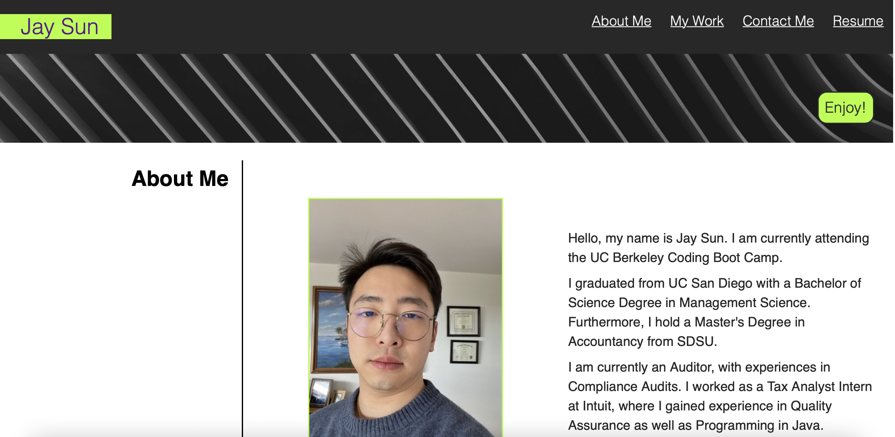
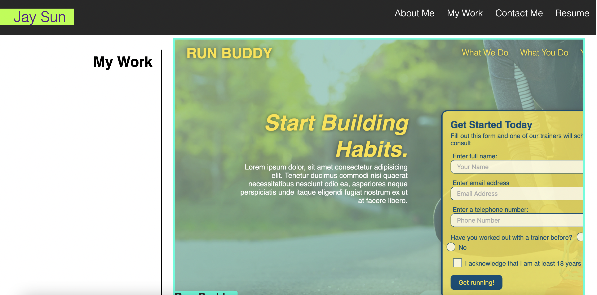
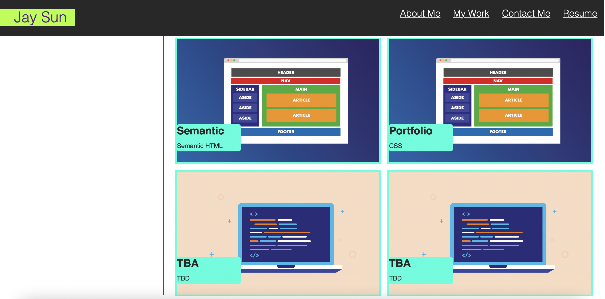
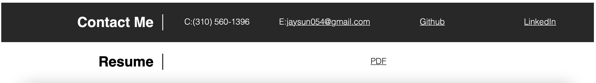

# Jay Sun's Portfolio

## Purpose
A website that showcase my portfolio's projects.

## Built With
* HTML
* CSS

## Website
https://jsun994.github.io/portfolio/

## Description
The portfolio website presents my name, photo, about me, my work, my contact information and my resume.
There are links in the navigation, and when clicked, it scrolls to the corresponding section.
My work contains titled images that are clickable, which takes the user to my applications.
First project image is larger than the rest.
This website is built to be responsive on various screen sizes.

